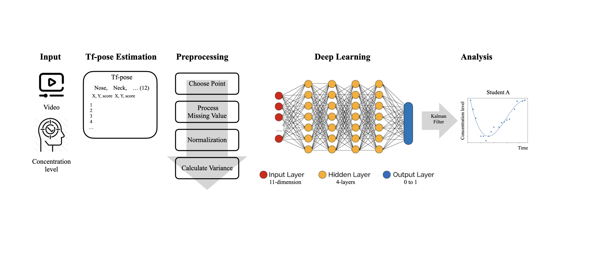

# Deep Learning on Human Conentration 

## Overview

figure 1. project overview

### Contributors
* [WoodoLee](https://github.com/WoodoLee)
* [lawkelvin33](https://github.com/lawkelvin33)
* [noparkee](https://github.com/noparkee)
* [ujos89](https://github.com/ujos89)

## Flow

### Step0. Environment Setting
ubuntu 20.04
gpu: GTX 1060 6GB
- main environment 
    - conda       4.8.3
    - python      3.6.12
- harness gpu
    - cuda        10.0
    - cudnn       7.6.5
    - tensorflow  1.15
    - keras       2.3.1
- visualization
    - matplotlib  3.3.1
    - seaborn     0.11.1
- process data
    - pandas      1.1.1
    - sklearn     0.23.2

### Step1. Video data to Pickle (video2pickle.py)
```sh
$ python3 video2pickle.py --video [video_name] --savefile [file_name_to_save]
```
We used [ildoonet/tf-pose-estimation](https://github.com/ildoonet/tf-pose-estimation.git) to extract each body part informations
save informations to pickle 
### Step2. Data Preprocessing (preprocessing.py)
```sh
$ python3 preprocessing.py --rawroot [raw_file_name] --label [contribute_or_not] --name [prepared_data_file_name]
```
In preprocessing.py...
- For each frame, we measured the distance to the nose from each of the 12 upper body parts by using L2-norm.
- For each part, fill missing data with median values and apply normalization.
- Calculate the variation of each part for every 100 frames and add labels.
- One row becomes one data.

### Step3. Merge prepared dataset & Shuffle
merge dataset and shuffle to prevent biased labeled value

### Step4. Traing DNN
explain model.

### Step5. Analysis
compared between size of data
